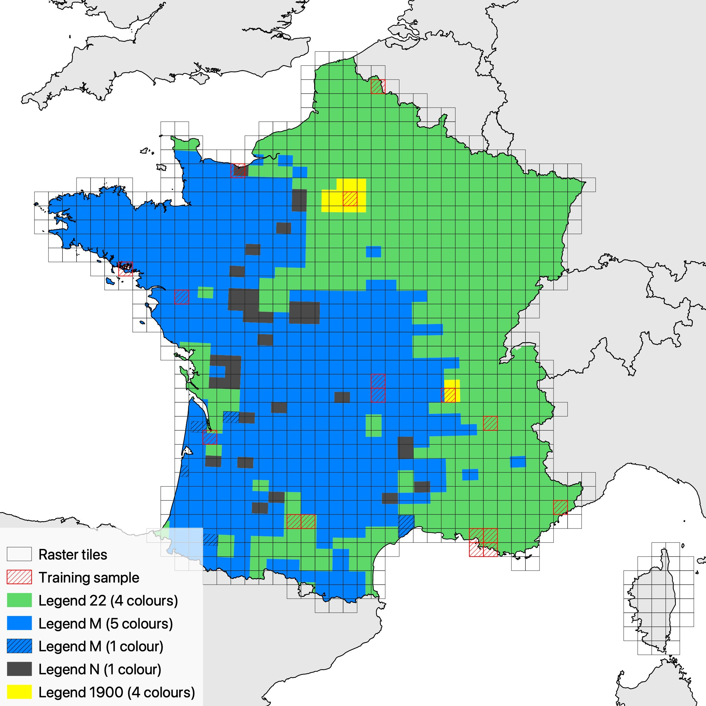
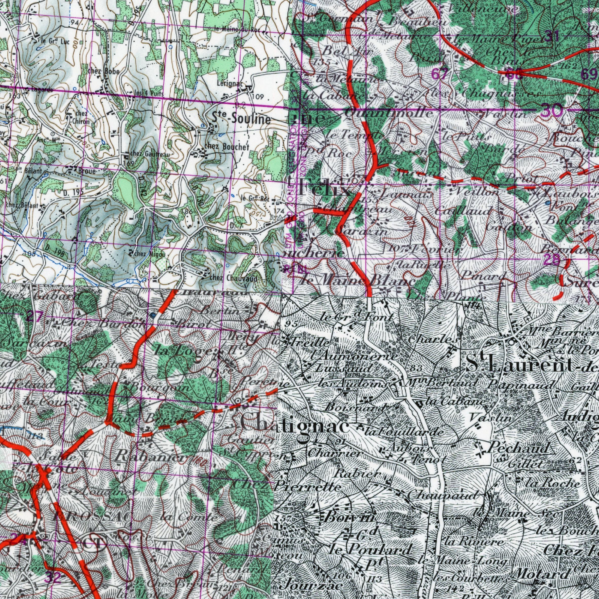

# Semantic segmentation of historical map data using convolutional networks

Clément Gorin, gorinclem@gmail.com

**Description:** This repository contains the replication code for the paper "Semantic segmentation of historical map data using convolutional networks".

We thank our research assistants Olena Bogdan, Célian Jounin, Siméon Mangematin, Matéo Moglia, Yoann Mollier-Loison, Rémi Pierotti and Nathan Vieira for vectorising manually the training sample. 

## Data

The image data is taken form French National Geographical Institute (IGN). The label data was created by manually labelling 17 tiles 

<!--

-->

**Images**

**Labels**

Label data were vectorised manually for 15 tiles by research assistant.

## Model

## Results